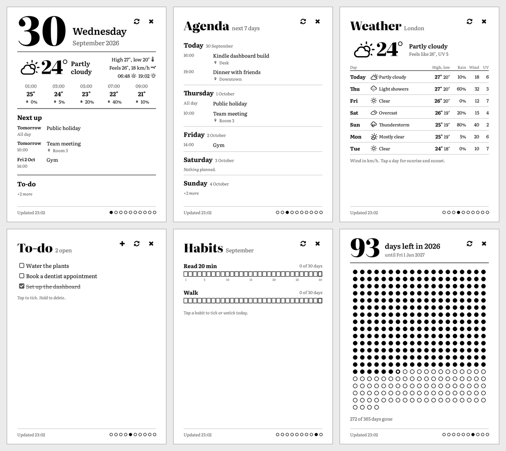

# kdash for KOReader

A desk dashboard for e-ink readers, drawn natively by KOReader so it responds
to taps. It reads one `data.json` from a GitHub repo and shows it as swipeable
pages: today, agenda, weather, to-dos, countdowns, a days-left dot grid, reading
list, habits, quote of the day and a photo.



| Tap | Does |
|---|---|
| An event (today, agenda) | Shows time, place, deadline |
| A forecast day, or today's weather | Shows rain, wind, UV, sun times |
| A to-do | Ticks or unticks it and commits `data/todos.md` to the repo |
| Hold a to-do | Deletes it (after asking) and commits `data/todos.md` |
| + (to-do page) | Adds a to-do with the on-screen keyboard |
| A habit | Ticks or unticks today and commits `data/habits.md` |
| A headline | Shows a QR code of the link, to open on your phone |
| Refresh (top right) | Starts the repo's render workflow, waits for it, downloads |

Swipe left or right to change page. Swipe down, or tap ×, to leave.

Changes show on screen straight away. If the commit fails (no Wi-Fi, a bad token,
or the file changed elsewhere), the change is undone and a message says why.
While open, it refreshes every 30 minutes, and after a wake if the data is older than that.

**Timed refresh:** while the dashboard is open and the Kindle is asleep, it wakes
itself at 7:00, 12:00, 17:00 and 21:00, refreshes (about 30 seconds) and goes back
to sleep, so the sleeping screen stays current. Change the times, or turn it off,
in Tools > Dashboard (kdash) > Timed refresh (hours or HH:MM, comma separated).
It uses KOReader's wakeup manager, which on a Kindle sets powerd's RTC alarm.

Developed for a Kindle Paperwhite 2 (758x1024) and checked in KOReader's desktop build. Sizes scale with the screen width.

## What it needs
On the device: KOReader, and nothing else. It needs no Python, SSH or USB
networking, and uses KOReader's own certificates for HTTPS. On a Kindle you still
need the jailbreak and KUAL to start KOReader.

On GitHub: a repo (it can be private) with:
- a branch `out` holding `data.json` (format below) and, optionally, the photo PNG
  it names;
- a workflow `render.yml` that writes them, runnable with workflow_dispatch
  (this is what Refresh starts);
- `data/todos.md` and `data/habits.md` on `main`, if you want tapping to save.

Keep this repo separate from the plugin, and private: it holds your to-dos,
habits, photo and settings, and its secrets (such as the calendar's .ics link)
are GitHub Actions secrets there, never on the device.

`generator/` is a ready-made one: a Python script and workflow that fetch the
weather, your calendar, RSS and arXiv on GitHub Actions in about 20 seconds.
Copy it into your own private repo; [generator/README.md](generator/README.md)
has the steps. Anything else that writes the same JSON works too. Branch,
workflow and refresh timings are constants at the top of `kdash.koplugin/main.lua`.

## Companion web page
The data repo publishes its own companion page on GitHub Pages
(`https://<you>.github.io/<data-repo>/`). It shows every page as the Kindle
draws it, and edits what each is made from: show, hide and reorder pages,
to-dos, habits, countdowns, the dots page, feeds and arXiv searches, quotes and
words, photos, and the location and calendar options. It also starts a
refresh. It asks only for the token (the same one as the Kindle), kept in that
browser. It's `generator/portal/`; see [generator/README.md](generator/README.md)
to switch it on.

## Install
First set up the data repo (see above and `generator/README.md`). Then:
1. Install KOReader (https://github.com/koreader/koreader/releases; for a
   Paperwhite 2 that's `koreader-kindlepw2-<version>.zip`).
2. Copy `kdash.koplugin/` to `koreader/plugins/`, and `fonts/literata/` to
   `koreader/fonts/literata/`. Then restart KOReader.
   - The fonts are Literata (SIL Open Font License, see `fonts/literata/OFL.txt`).
     Without them the plugin uses Noto Serif, which KOReader ships.
   - The icons are Weather Icons and Font Awesome, from KOReader's own
     `fonts/nerdfonts/symbols.ttf`.
3. In Tools (the wrench menu) > Dashboard (kdash), set:
   - **GitHub repo:** `owner/name`.
   - **GitHub token:** a fine-grained token for that repo only, with Contents and
     Actions read and write.

   Typing a token on the keyboard is tedious. Instead, you can put the two values
   in `koreader/kdash/repo.txt` and `koreader/kdash/token.txt` over USB.
   Settings made in the menu win.
4. Tools > Dashboard (kdash) > Open dashboard. For one-tap access, bind
   General > Dashboard (kdash) to a gesture in Settings > Taps and gestures >
   Gesture manager.

## Updating
Tools > Dashboard (kdash) > Update plugin downloads the latest `main.lua` and
`_meta.lua` from this repo's `main` branch, checks that they load, replaces the
installed ones and offers to restart KOReader. No USB needed. The URL is
`PLUGIN_URL` at the top of `kdash.koplugin/main.lua`; point it at your fork if you
change the plugin. Fonts aren't updated this way.

## Recommended KOReader settings
- **Sleep screen:** Settings > Screen > Sleep screen > Wallpaper > "Leave screen
  as-is". The dashboard then stays on screen while the device sleeps.
- **Wi-Fi:** Settings > Network > Action when Wi-Fi is off > Turn on. Without it,
  KOReader asks before every refresh and every tap that saves.

## data.json
```json
{
  "updated": "2026-09-30T20:38Z",
  "today": "2026-09-30",
  "location": "City name",
  "pages": [
    { "name": "today", "data": { } },
    { "name": "photo", "png": "photo.png", "data": { } }
  ]
}
```
- Pages show in the order listed. A page is drawn from its `data`.
- Dates are ISO text. Leave out missing values; don't use `null`.
- An unknown page name shows a placeholder.

| Page | `data` fields |
|---|---|
| today | `weather`, `upcoming` (events), `open_todos` (to-dos), `has_calendar`, `weather_error`, `events_error` |
| agenda | `agenda`: list of `{date, today, events}` |
| weather | `weather` |
| todos | `todos`: list of `{text, done}` |
| countdowns | `countdowns`: list of `{name, date, days}` |
| dots | `name`, `end`, `left`, `gone`, `total` |
| reading | `sections`: list of `{name, entries: [{title, meta, link}]}` |
| habits | `habits`: `{month, ndays, day, rows: [{name, days, count, streak}]}` |
| quote | `quote`: `{text, author}`, `word`: `{word, kind, meaning, example}` |
| photo | none; its `png` (a path on `out`) is downloaded and shown full screen. Only the photo page has a `png` |

- An event is `{title, location, allday, start, end, deadline}`.
- `weather` is `{temp, feels, desc, wind, uv, hours: [{time, temp, rain}], days: [{date, desc, hi, lo, rain, wind, uv, sunrise, sunset}]}`.
- `desc` uses the WMO wording ("Partly cloudy", "Light showers", ...), which picks the icon.
- Any `*_error` text is shown on the page.

Formats of the files the taps edit:
- `data/todos.md`: lines of `- [ ] text` or `- [x] text`.
- `data/habits.md`: a `## YYYY-MM` section per month, with lines like
  `Habit name: 1 2 5` (the days done).

## Developing
- `luac -p kdash.koplugin/*.lua` checks syntax.
- To see it without a device, run the KOReader macOS build (nightly
  `koreader-macos-*.7z` from the `ota` release):
  1. Set `KO_HOME=<scratch dir>`.
  2. Symlink the plugin into `$KO_HOME/plugins/`.
  3. Put a `data.json` in `$KO_HOME/cache/kdash/`.
  4. Launch with `EMULATE_READER_W=379 EMULATE_READER_H=512 EMULATE_READER_DPI=106 ./luajit reader.lua`.
     That gives a 758x1024 framebuffer on a Retina Mac.
- The plugin logs to `crash.log` with lines starting `kdash:`.

## License
The plugin is AGPL-3.0, like KOReader (see `LICENSE`). The Literata fonts are
under the SIL Open Font License (`fonts/literata/OFL.txt`).
